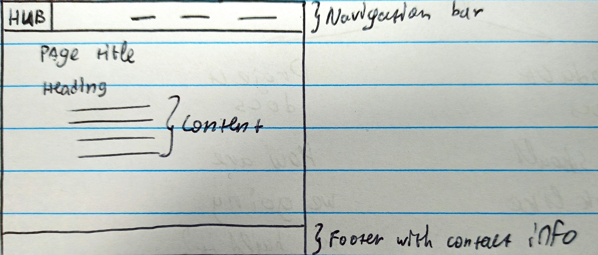
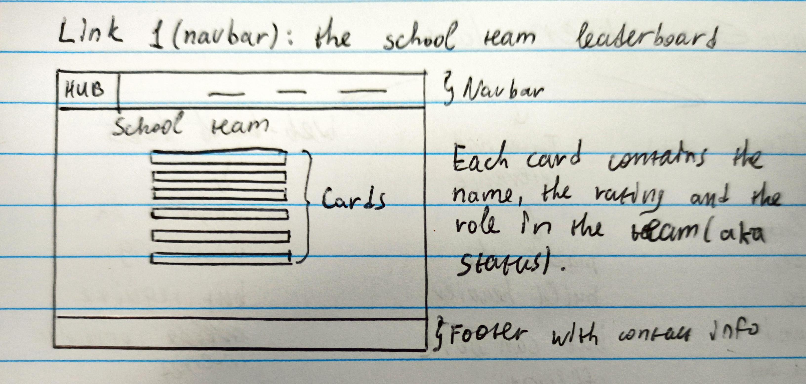
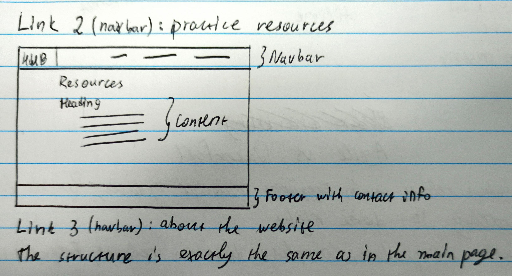
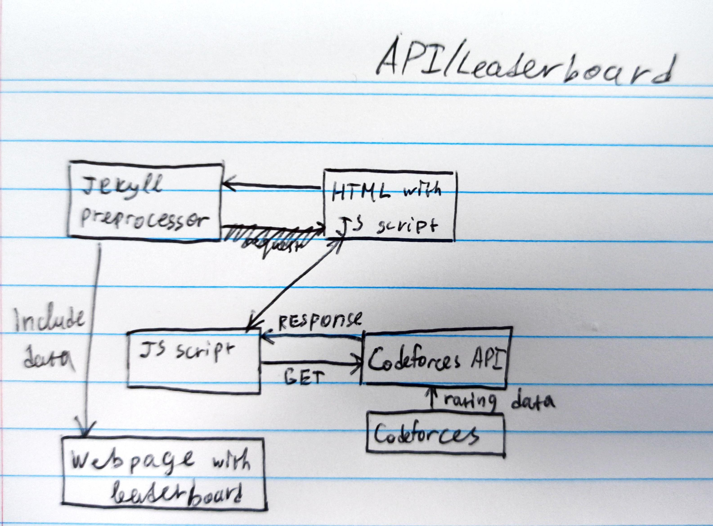

# Criterion B

### Record of tasks

|     Task number    |     Planned action                                                       |     Planned outcome                                                                                                                                        |     Time estimated    |     Target completion date    |     Criterion    |
|--------------------|--------------------------------------------------------------------------|------------------------------------------------------------------------------------------------------------------------------------------------------------|-----------------------|-------------------------------|------------------|
|     1              |     Getting information from the client and end users (e.g. students)    |     The technical requirements are finalised and confirmed by the   client                                                                                 |     3 days            |     1.04.23                   |     A            |
|     2              |     Creating trainings                                                   |     Up to 8 trainings are created from scratch, some others are   polished and expanded with Polygon                                                       |     1 month           |     1.05.23                   |     B, C         |
|     3              |     Testing the trainings                                                |     A closed group of students and the client check the trainings by   participating in some of them and give me feedback about possible   improvements    |     1 week            |     7.05.23                   |     E            |
|     4              |     Designing the website structure and UI                               |     The structure and UI are finalised and ready to implement in code                                                                                      |     2 days            |     9.05.23                   |     B            |
|     5              |     Creating the website                                                 |     The website is ready except for the technical details such as APIs   for the leaderboard                                                               |     1 week            |     16.05.23                  |     B, C         |
|     6              |     Adding technical details, powering up the leaderboard                |     The website is fully ready for production and deployment ase well   as for the beta testing phase                                                      |     1 week            |     23.05.23                  |     B, C         |
|     7              |     Deployment                                                           |     The website and the trainings are accessible for everyone on the   internet thanks to GitHub pages                                                     |     3 days            |     26.05.23                  |     C            |
|     8              |     Beta testing and polishing                                           |     The website is up and running and the client is satisfied with the   result                                                                            |     1 week            |     02.06.23                  |     A, C, E      |
|                    |                                                                          |                                                                                                                                                            |                       |                               |                  |

### Website structure

### Test plan

|                                |     Planned action                                              |     Planned outcome                                                   |     Time estimated                                                                                                       |
|--------------------------------|-----------------------------------------------------------------|-----------------------------------------------------------------------|--------------------------------------------------------------------------------------------------------------------------|
|     Test type                  |     Nature of test                                              |     Example                                                           |     Expected outcome                                                                                                     |
|     Navigation   bar test      |     Checking   if the links redirect the user to right pages    |     The   user clicks the "About" link                                |     The   user is redirected to the "About" page                                                                         |
|     Home   button test         |     Checking   if the home link is working                      |     The   user clicks the "Hub" link                                  |     The   user is redirected to the home page                                                                            |
|     Leaderboard   test         |     Validation   of the leaderboard generation                  |     The   user goes to the leaderboard page                           |     The   leaderboard is fully filled in and displays correct and valid data                                             |
|     Math   display test        |     Checking   for MathJax rendering on the Resources page      |     The   Resources page is opened                                    |     The   math is rendered correctly and is clickable and selectable                                                     |
|     Links   redirects          |     Checking   for broken links or duplicating links            |     The   user goes to one of the websites linked in the main page    |     The   user is redirected to the needed page                                                                          |
|     Leaderboard   redirects    |     Testing   the correctness of leaderboard links redirects    |     The   user clicks a leaderboard card                              |     The   user is redirected to a Codeforces profile of the competitor specified on the   card                           |
|     Adaptivity   test          |     Checking   the website look on mobile devices               |     The   user opens the website on a mobile device or a tablet       |     The   website and the leaderboard are rendered and working correctly without   accessibility and usability issues    |